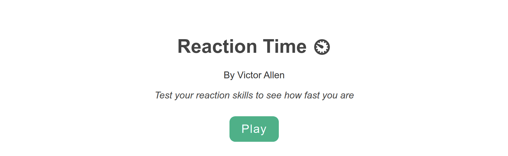
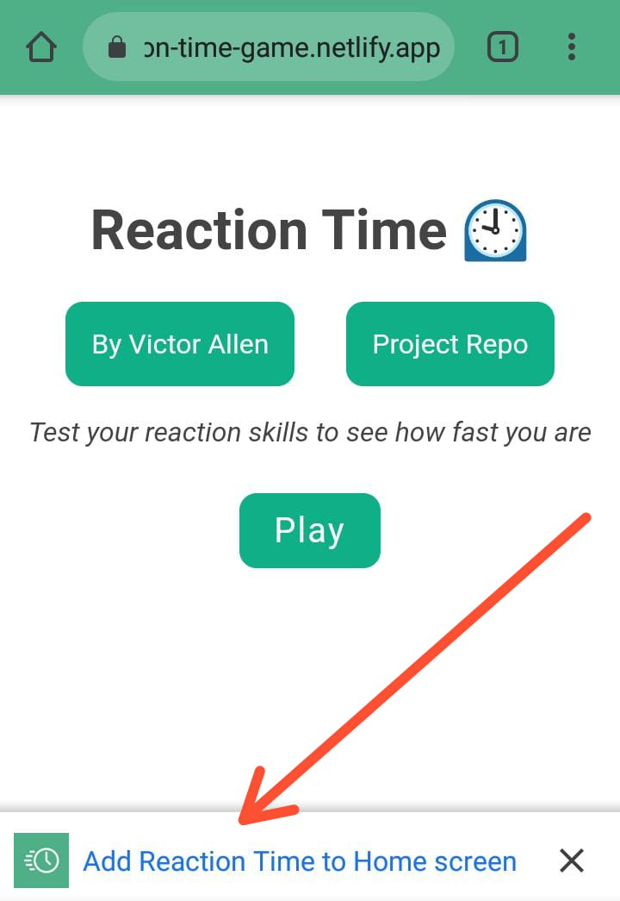
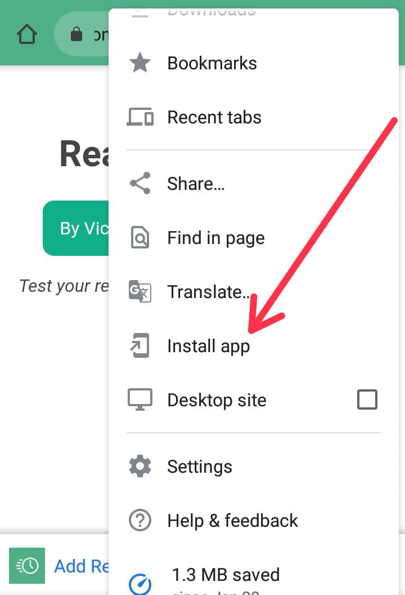
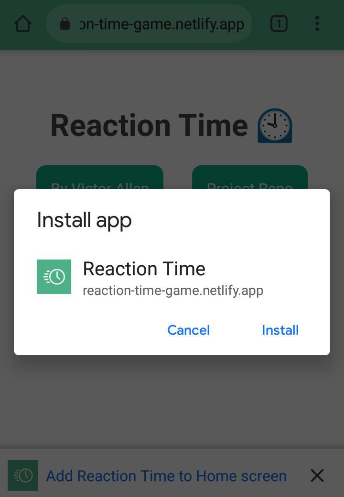
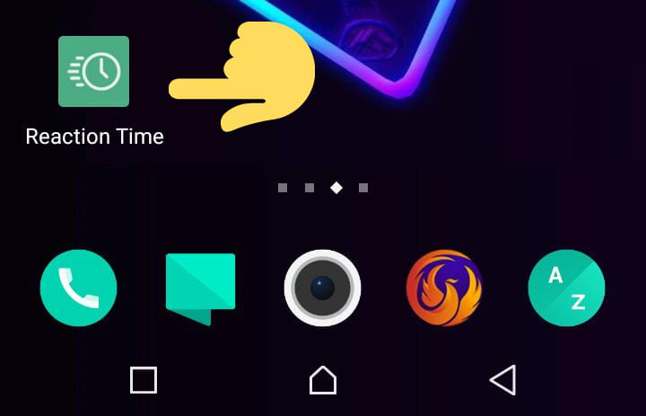

# Reaction-time ⏲️

[](https://app.netlify.com/sites/reaction-time-game/deploys)

Reaction Time is a Vue 3 Progressive Web App that tests your reaction time skills to see how fast you are. The app works on both desktop 💻 and mobile devices 📱



## Project setup

These instructions will get you a copy of the project up and running on your local machine for development and testing purposes.

### Prerequisites

What things you need to install the software and how to install them

```
* npm 7.3.0 or latest
* Node.js 15.5.1 or latest
```

### Installing

A step by step series of examples that tell you how to get a development env running

Open Terminal / Command Prompt and type:

```
git clone https://github.com/vamuigua/reaction-time.git
```

Then change your directory to the project you have cloned

```
cd reaction-time
```

#### Install packages using npm

```
npm install
```

#### Compiles and hot-reloads for development

```
npm run serve
```

#### Compiles and minifies for production

```
npm run build
```

#### Serve the compiled production assets in the browser

```
cd dist && npx http-server
```

**Note: http-server is a command-line http server**

#### Open application on:

http://127.0.0.1:8080
Your done...The app should now be running on your browser 👍

## Run App on Android, IOS, Windows etc.

### Step 1

### Option 1:

- Open this [link](https://reaction-time-game.netlify.app/) on your mobile device
- Click the 'Add Reaction Time to Home screen' & wait for the app to install on your device.



### Option 2:

- Open this [link](https://reaction-time-game.netlify.app/) on your mobile device.
- Click on the options menu on top-right (varies from devices)
- Click on "Install App"



### Step 2

- Click Install & wait for the app to install your device



### Step 3

- Once completed with the previous steps, the app should be located on your Home screen.
- Open it!



- And THAT'S IT 😎 Have FUN 🎉
  

### Customize configuration

See [Configuration Reference](https://cli.vuejs.org/config/).

## Built With

- [Vue 3](https://v3.vuejs.org/)
- [Vue pwa plugin](https://cli.vuejs.org/core-plugins/pwa.html#configuration) - turns the core vue app into a pwa
- [vue-pwa-asset-generator](https://github.com/jcalixte/vue-pwa-asset-generator) - to generate all required custom icons

## Authors

- **Victor Allen** - [vamuigua](https://github.com/vamuigua) :v:

## License

This project is licensed under the MIT License - see the [LICENSE.md](LICENSE.md) file for details

## Acknowledgments

- **The Net Ninja** - [iamshaunjp](https://github.com/iamshaunjp)
